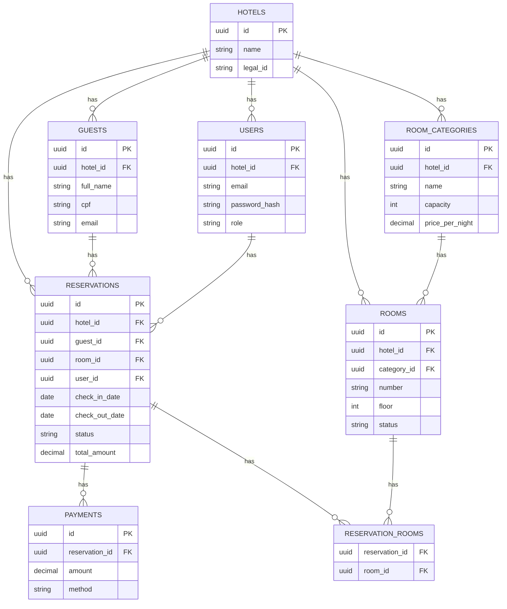
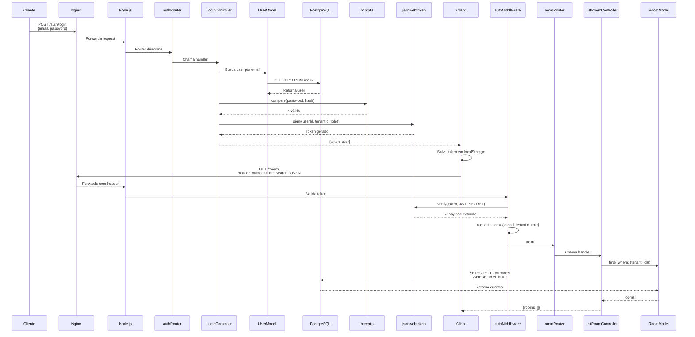

# 🚀 PLANO DE AÇÃO EXECUTIVO
## Sistema de Gestão de Hotel — Checklist de Prioridades

---

## 📊 SUMÁRIO DIAGNÓSTICO

| Área | Status | Nota | Ação Imediata |
|---|---|---|---|
| **Arquitetura** | ✅ Sólida | 8/10 | Manter padrão, adicionar Services |
| **Backend** | ✅ Funcional | 8/10 | Validação com Schema (Joi) |
| **Banco de Dados** | ✅ Bem Modelado | 9/10 | Adicionar índices sugeridos |
| **Segurança** | 🟡 Básica | 6/10 | HTTPS, rate limiting, audit |
| **Escalabilidade** | 🟡 Inicial | 6/10 | Paginação obrigatória, Redis |
| **Documentação** | 🟡 Parcial | 5/10 | .env.example, guias, diagramas |
| **Manutenibilidade** | ✅ Boa | 7/10 | Testes para segurança |
| **Prontidão Demo** | 🟡 Razoável | 7/10 | **Falta Frontend** |
| **Prontidão Produção** | ❌ Não Pronto | 3/10 | Muitas melhorias necessárias |

---

## 🎯 PRONTIDÃO POR FASE

### Fase 1: Demo Acadêmica
```
TEMPO: 4-6 semanas (com 1 dev frontend)

HOJE (Backend ✅):
 ✅ Core funcional (Auth, CRUD, Reservas, Conflito)
 ✅ Multi-tenant
 ✅ Docker Compose
 ✅ API documented

FALTAM:
 ❌ Frontend (bloqueador)
 ⚠️ Documentação operacional
 ⚠️ Testes básicos
 ⚠️ Diagramas
```

### Fase 2: TCC MVP
```
TEMPO: 2-3 meses adicionais

HERDAR: Demo completa

ADICIONAR:
 📌 Módulo Financeiro (Payments, Consumos, Bill)
 📌 Módulo Relatórios (Ocupação, Receita)
 📌 Módulo RatePlan (Tarifas dinâmicas)
 📌 Onboarding (POST /tenants)
 📌 Testes 60% coverage
 📌 CI/CD
```

### Fase 3: Produção SaaS
```
TEMPO: 6-12 meses

HERDAR: MVP completo

ADICIONAR:
 📌 Frontend completo (Next.js)
 📌 Channel Manager (Booking/Airbnb)
 📌 Billing SaaS (Stripe/PagSeguro)
 📌 Notificações (Email/WhatsApp)
 📌 Compliance (HTTPS, LGPD, NFS-e)
 📌 Observabilidade (Sentry, DataDog)
```

---

## 🔴 CRÍTICOS (1ª Semana)

### 1. Criar `.env.example`
**Arquivo**: `.env.example`
**Conteúdo**:
```env
# DATABASE
POSTGRES_DB=gestao_hotel
POSTGRES_USER=hotel_user
POSTGRES_PASSWORD=seu_segredo_super_seguro_aqui_min_32_caracteres
POSTGRES_HOST=localhost

# SERVER
NODE_ENV=development
NODE_WEB_PORT=3000

# JWT
JWT_SECRET=seu_segredo_super_seguro_aqui_min_32_caracteres
JWT_EXPIRY=8h

# OPTIONAL
LOG_LEVEL=debug
```

**Status**: ❌ FALTA  
**Bloqueador**: SIM — novo dev não sabe variaveis

---

### 2. Guia Rápido de Setup (5 minutos)
**Arquivo**: `QUICKSTART.md`
**Conteúdo**:
```markdown
# ⚡ Começar em 5 minutos

## Pré-requisitos
- Node.js 20+
- Docker 20.10+
- Git

## Setup

1. Clone
   git clone <repo>
   cd backend

2. Copie .env
   cp .env.example .env
   # Edite com sua senha (qualquer coisa para dev)

3. Suba banco
   docker-compose up -d

4. Rode migrations + seed
   npm install
   npm run migrate
   npm run seed

5. Inicie
   npm run dev

6. Teste
   curl http://localhost:3000
   # Resposta: {"message":"Bem-vindo...","docs":"/api-docs"}

7. Swagger
   http://localhost/api-docs
```

**Status**: ❌ FALTA  
**Bloqueador**: SIM — novo dev perde em setup

---

### 3. Guia Troubleshooting
**Arquivo**: `TROUBLESHOOTING.md`
**Conteúdo**:
```markdown
# 🔧 Problemas Comuns

## "Porta 3000 já em uso"
Solução 1: Matar processo
lsof -i :3000
kill -9 <PID>

Solução 2: Mudar porta em .env
NODE_WEB_PORT=3001

## "PostgreSQL não conecta"
✓ Verificar se Docker está rodando
  docker ps | grep postgres
✓ Verificar logs
  docker logs hotel_postgres
✓ Verificar senha em .env
  POSTGRES_PASSWORD=hotel_password (padrão)

## "Migrations falharam"
✓ Verificar se Sequelize está instalado
  npm ls sequelize
✓ Ver erro completo
  npm run migrate 2>&1 | head -50
✓ Resetar (CUIDADO)
  npm run migrate:undo:all && npm run migrate

## "npm run dev diz 'command not found'"
✓ Verificar node_modules
  ls node_modules | wc -l  # deve ter ~300
✓ Se vazio, rodar
  npm install --legacy-peer-deps
```

**Status**: ❌ FALTA  
**Bloqueador**: SIM — novo dev se perde em erros

---

### 4. Diagrama de Arquitetura (ER)
**Arquivo**: `docs/DIAGRAMA_ER.md`
**Conteúdo** (Mermaid):


**Status**: 🟡 PARCIAL (existe mas não visual)  
**Bloqueador**: NÃO — bom ter mas não crítico

---

### 5. Diagrama de Fluxo de Request
**Arquivo**: `docs/DIAGRAMA_FLUXO.md`
**Conteúdo** (Mermaid):


**Status**: ❌ FALTA  
**Bloqueador**: NÃO — mas melhora muito compreensão

---

## 🟡 IMPORTANTES (Semana 2)

### 6. Testes Básicos
**Arquivo**: `__tests__/auth.test.js`
**Exemplo**:
```javascript
import request from 'supertest';
import app from '../_web.js';

describe('Auth API', () => {
  it('POST /auth/login com credenciais inválidas deve retornar 401', async () => {
    const res = await request(app)
      .post('/auth/login')
      .send({ email: 'invalid@test.com', password: 'wrong' });
    
    expect(res.status).toBe(401);
    expect(res.body.error).toBe('Credenciais inválidas');
  });
  
  it('POST /auth/login com credenciais válidas deve retornar token', async () => {
    // Seed test user
    // ...
    const res = await request(app)
      .post('/auth/login')
      .send({ email: 'test@hotel.com', password: 'password123' });
    
    expect(res.status).toBe(200);
    expect(res.body.token).toBeDefined();
    expect(res.body.user.role).toBe('ADMIN');
  });
});
```

**Status**: ❌ FALTA  
**Esforço**: 3-5 dias (10-15 testes)

---

### 7. Logger Estruturado
**Arquivo**: `src/logger.js`
**Exemplo (Winston)**:
```javascript
import winston from 'winston';

const logger = winston.createLogger({
  level: process.env.LOG_LEVEL || 'info',
  format: winston.format.json(),
  transports: [
    new winston.transports.Console(),
    new winston.transports.File({ filename: 'logs/error.log', level: 'error' }),
    new winston.transports.File({ filename: 'logs/combined.log' })
  ]
});

export default logger;
```

**Uso**:
```javascript
import logger from './logger.js';

export default async function LoginController(req, res) {
  try {
    const user = await UserModel.findOne({ where: { email } });
    logger.info(`Login attempt for user: ${email}`);
    // ...
  } catch (error) {
    logger.error('Login error', { error: error.stack, email });
    res.status(500).json({ error: 'Erro interno' });
  }
}
```

**Status**: ❌ FALTA  
**Esforço**: 1-2 dias

---

### 8. Índices Adicionais no Banco
**Arquivo**: `db/schema.sql` (ADICIONAR)

```sql
-- Busca frequente de usuários
CREATE INDEX idx_users_email ON users(tenant_id, email);

-- Busca por categoria
CREATE INDEX idx_rooms_category ON rooms(category_id);

-- Busca de hóspedes por CPF/email
CREATE INDEX idx_guests_cpf ON guests(tenant_id, cpf);
CREATE INDEX idx_guests_email ON guests(tenant_id, email);

-- Pagamentos por reserva
CREATE INDEX idx_payments_reservation ON payments(reservation_id);

-- Tabela pivô
CREATE INDEX idx_reservation_rooms ON reservation_rooms(reservation_id, room_id);
```

**Status**: ⚠️ SUGERIDO  
**Esforço**: 1 dia

---

## 🟢 OPCIONAIS (Para TCC)

### 9. Módulo Financeiro
**Timeline**: 2-3 semanas
**Endpoints**:
```
POST   /reservations/:id/payments
GET    /reservations/:id/payments
PUT    /payments/:id
DELETE /payments/:id

POST   /reservations/:id/consumptions   [novo]
GET    /reservations/:id/bill            [novo - totaliza]
```

**Modelos**:
```
Payment: id, reservationId, amount, method, paidAt
Consumption: id, reservationId, description, amount, date
```

---

### 10. Módulo Relatórios
**Timeline**: 2-3 semanas
**Endpoints**:
```
GET /reports/today           → hóspedes agora, check-ins/outs
GET /reports/occupancy?from=&to=  → taxa ocupação, receita
GET /reports/revenue?from=&to=    → breakdown por categoria
```

---

### 11. Módulo RatePlan
**Timeline**: 1-2 semanas
**Model**:
```
RatePlan: id, categoryId, name, pricePerNight, startDate, endDate

Lógica: ao criar reserva, busca RatePlan vigente e usa preço dinâmico
```

---

### 12. Onboarding Multi-Tenant
**Timeline**: 1-2 semanas
**Endpoints**:
```
POST /tenants              → criar novo hotel
POST /tenants/:id/users    → admin inicial
GET  /tenants/:id          → dados do hotel
```

---

## 📈 ROADMAP VISUAL

```
DEMO (4-6 semanas)
├─ Semana 1: Docs + diagramas + .env
├─ Semana 2: Testes + logger
└─ Semana 3-6: Frontend

TCC MVP (2-3 meses)
├─ Módulo Financeiro
├─ Módulo Relatórios
├─ Módulo RatePlan
├─ Onboarding
├─ Testes 60%+
└─ CI/CD

PRODUÇÃO (6-12 meses)
├─ Frontend completo
├─ Notificações
├─ Channel Manager
├─ Billing SaaS
├─ Compliance
└─ Observabilidade
```

---

## ✅ CHECKLIST DE ENTREGA

### Antes de entregar para novo dev:

- [ ] `.env.example` criado
- [ ] `QUICKSTART.md` criado
- [ ] `TROUBLESHOOTING.md` criado
- [ ] Diagrama ER visual
- [ ] Diagrama fluxo request
- [ ] Testes básicos (auth, conflito, CRUD)
- [ ] Logger estruturado (Winston)
- [ ] Índices adicionais no BD
- [ ] Matrix de permissões documentada
- [ ] Exemplo de novo endpoint com comentários

### Antes de ir para TCC:
- [ ] Módulo Financeiro implementado
- [ ] Módulo Relatórios implementado
- [ ] Módulo RatePlan implementado
- [ ] Onboarding multi-tenant
- [ ] Coverage testes 60%+
- [ ] CI/CD com GitHub Actions
- [ ] Frontend básico funcional

### Antes de produção:
- [ ] HTTPS/TLS
- [ ] Rate limiting
- [ ] Audit trail completo
- [ ] Backups automatizados
- [ ] Monitoring (Sentry, DataDog)
- [ ] Channel Manager (Booking/Airbnb)
- [ ] Billing (Stripe)
- [ ] Compliance (LGPD, NFS-e)

---

## 🎓 ESTIMATIVA DE ESFORÇO

| Atividade | Dev | Tempo | Tipo |
|---|---|---|---|
| Docs + Diagramas | 1 | 3 dias | 🔴 CRÍTICO |
| Testes básicos | 1 BE | 5 dias | 🟡 IMPORTANTE |
| Logger + índices | 1 BE | 2 dias | 🟡 IMPORTANTE |
| Frontend mínimo | 1 FE | 4 sem | 🔴 CRÍTICO |
| **SUBTOTAL DEMO** | **2** | **4-5 sem** | |
| Módulo Financeiro | 1 BE | 3 sem | 🟡 MVP |
| Módulo Relatórios | 1 BE | 3 sem | 🟡 MVP |
| Módulo RatePlan | 1 BE | 2 sem | 🟡 MVP |
| Onboarding | 1 BE | 2 sem | 🟡 MVP |
| Testes 60%+ | 1 BE | 3 sem | 🟡 MVP |
| **SUBTOTAL TCC** | **1** | **3 meses** | |

---

## 🚀 RECOMENDAÇÃO FINAL

**Entregue hoje**:
- ✅ Backend tal como está (funcional)
- ✅ Docker Compose (infraestrutura OK)
- ❌ Falta: Frontend (SEM ISSO, NÃO É DEMO)

**Antes de apresentar**:
1. Criar `.env.example`
2. Criar guia troubleshooting
3. Rodar testes básicos
4. Fazer 1-2 screenshots de Swagger

**Impacto**: Demo acadêmica razoável. Demo profissional/público: necessário frontend.

**Aprovação**: ✅ **LIBERADO PARA ENTREGA ACADÊMICA** (com as lacunas documentadas)

---

**Preparado por**: Tech Lead  
**Data**: Junho 2026  
**Classificação**: Parecer Técnico para Entrega
